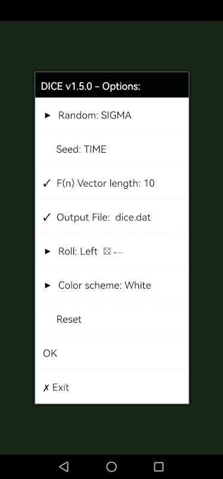
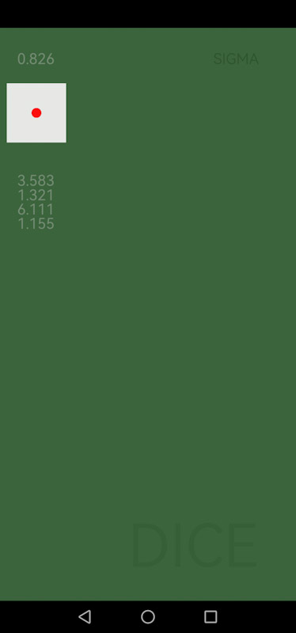
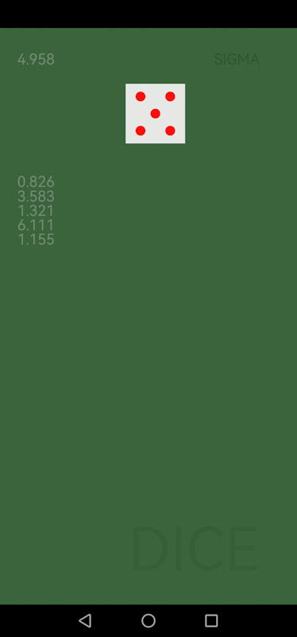

# DICEandro
[Demo movie](https://m.youtube.com/watch?v=Chh-5Eay2-I)

Quasi random number generator via simulated dice roll for Android. Both, the system's own and the *SIGMA* quasi-random function $n$ are used, where

$$n_i=a⋅r_{n_{i-1}^\varsigma}-int(a⋅r_{n_{i-1}^\varsigma}),$$

with restvalue $r_x$, $a=10^3$, $\varsigma=\frac{34}{45}$.
See `sigma.inc`, Schrausser ([2022a](https://doi.org/10.13140/RG.2.2.28314.52164), p. 17).

